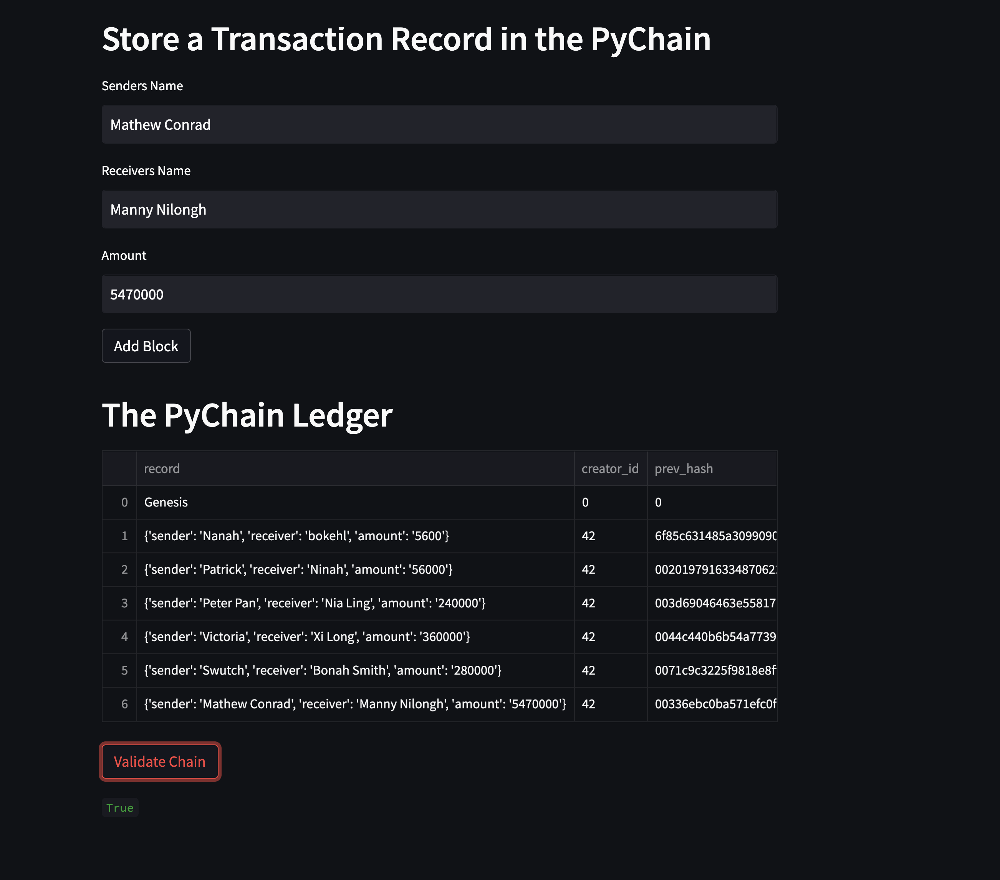
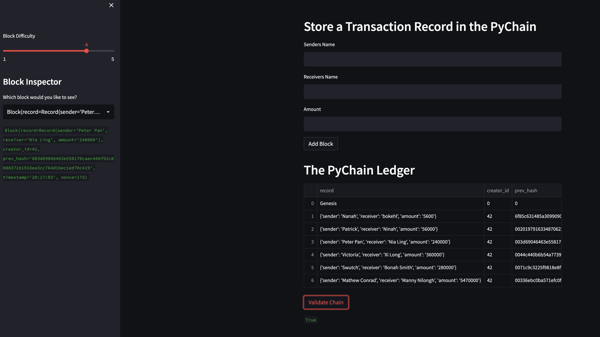

# Blockchain Ledger System

## Table of Contents

 1. Project Motivation
 2. About the Application
 3. Techologies Used
 4. File Descriptions
 5. How to Run
 6. License
 

----------------------------

##  Project Motivation

This project is in completion of the Columbia University FinTech 2022 bootcamp module eighteen weekly challenge exercise.


## About the Application

This application create and validate a blockchain based ledger system.


## Technologies Used

The application is written in python programming langauge. Users need a device that can run python3 applications. Other python applications, libraries and frameworks used in this project include:


## File Descriptions

1. Starter_Code
- pychain.py
- Resources
  - add_blockchain_blocks.png
  - validate.png

2. requirements.txt

3. README.md

-----------------

## How to Run

1. Clone this repo 

2. In your terminal

```
  conda create -n <evn_name> python=3.7 
  conda activate <evn_name>
  git clone <link to repo>
  pip install -r requirements.txt 
  steamlit run pychain.py

```
 
 
3. On your browser enter
 - Senders name
 - Receivers name
 - Amount
4. Click on 'Add Block' botton



5. Validate the ledger
 - click on 'Validate Chain' botton




## License
This project is in completion of the Columbia University FinTech 2022 bootcamp module eighteen weekly challenge exercise. It should not be copied and used for commercial purpose without the authorization of the admin of this repo. For futher information please contact Patrick via email on pruejoma@gmail.com